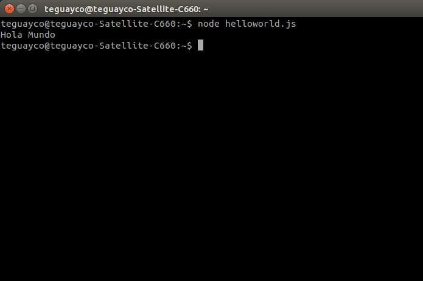
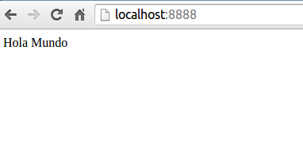

Tutorial - Instalación y uso de herramientas
=======

1. NodeJS
-----------

### 1.1 ¿Qué es NodeJS? ¿Y NPM?

Node.js es una librería y entorno de ejecución de E/S dirigida por eventos y por lo tanto asíncrona que se ejecuta sobre el intérprete de JavaScript creado por Google V8.

Cuando comenzamos a trabajar con NodeJS necesitamos nuevos módulos que instalar (librerías) ya que Node, al ser un sistema fuertemente modular, viene prácticamente vacío. Para facilitar esta tarea es por lo que se utiliza la herramienta NPM (de sus siglas en inglés, Node Package Manager).

### 1.2 Instalación de NodeJS en Ubuntu 14.04

Para instalar NodeJS en Ubuntu, haremos uso de un terminal. En él, escribiremos la siguiente secuencia de comandos:

    $ sudo apt-get update
    $ sudo apt-get install nodejs
    $ sudo apt-get install npm

Con la primera línea, actualizamos el listado de paquetes disponibles. La segunda y la tercera las utilizamos para descargar e instalar NodeJS (línea 2) y Node Package Manager (línea 3).

Crearemos además el siguiente enlace simbólico, lo cual nos ahorrará problemas a la hora de ejecutar NodeJS:

    $ sudo ln -s /usr/bin/nodejs /usr/bin/node

Ejecutando los siguientes comandos obtendremos las versiones de las herramientas   instaladas anteriormente. De esta manera, comprobamos que funcionan correctamente:

    $ node -v
    $ npm -v

### 1.3 Hola Mundo con NodeJS

Para ilustrar el funcionamiento básico de NodeJS con un ejemplo mostraremos el mensaje "Hello, World!" por pantalla. En primer lugar, incluimos la siguiente línea de código en nuestro fichero "helloworld.js":

    1. console.log("Hello, World!");

Para ejecutarlo, lanzamos node desde un terminal pasando como parámetro en línea de comandos el nombre del fichero que contiene nuestro código javascript:

    $ node helloworld.js

Como puede comprobarse en la siguiente imagen, se muestra correctamente el mensaje en pantalla:

  

### 1.4 Un ejemplo más práctico: servidor HTTP básico

Sin entrar en detalles de implementación, copiaremos el código siguiente a un fichero llamado "server.js" y lo ejecutaremos desde un terminal:

    var http = require("http");

    http.createServer(function(request, response) {
      response.writeHead(200, {"Content-Type": "text/html"});
      response.write("Hola Mundo");
      response.end();
    }).listen(8888);

Básicamente, este servidor se encarga de escuchar peticiones en el puerto 8888 de nuestra máquina y, cuando escribamos en la barra de direcciones "http://localhost:8888/", se desplegará un página con el mensaje "Hola Mundo".

  

2. Express
-----------

### 2.1 ¿Qué es Express?

Express es una infraestructura de aplicaciones web Node.js mínima y flexible que proporciona un conjunto sólido de características para las aplicaciones web y móviles.

### Instalación

La instalación de Express en un sistema Ubuntu se realiza de manera rápida y sencilla. Tan sólo debe ejecutarse la siguiente línea desde un terminal:

    1. $ npm install express --save

3. Git
-----------

### 3.1 ¿Qué es Git?

Git es un software de control de versiones diseñado por Linus Torvalds, pensando en la eficiencia y la confiabilidad del mantenimiento de versiones de aplicaciones cuando éstas tienen un gran número de archivos de código fuente.

### 3.2 Instalación

Escribiremos lo siguiente desde un terminal para instalar Git:

    1. $ sudo apt-get install git

### 3.3 Comandos básicos

A continuación se recogen los principales comandos que se utilizan en Git:

  * **git branch**: lista todas las ramas locales.
  * **git branch nombre_rama**: crea una rama con el nombre especificado.
  * **git status**: muestra el estado actual de la rama.
  * **git commit -m "message"**: se confirman los cambios realizados y se proporcina una pequeña descripción con los cambios realizados.
  * **git push -u origin nombre_rama**: sube la rama "nombre_rama al repositorio apuntado por "origin".
  * **git branch -d nombre_rama**: elimina una rama.
  * **git log**:  lista las confirmaciones hechas sobre el repositorio en orden cronológico inverso.
  * **git clone repositorio**: se clona el repositorio en nuestra máquina local.

4. Pandoc
-----------

Pandoc es un traductor de diferentes formatos (Markdown, LaTeX, HTML, murkup, etc).

### Instalación

Para instalarlo, ejecutamos lo siguiente desde el terminal:

    $ sudo apt-get install pandoc

### Ejemplo de uso

Veamos cómo podemos traducir un fichero en formato Markdown a HTML haciendo uso de Pandoc.

Supongamos que nuestro fichero en formato Markdown se llama "prueba1.md" y que lo queremos traducir a HTML. Para ello, haríamos ejecutaríamos desde un terminal lo que a continuación se muestra:

    $ pandoc -f markdown -t html prueba1.md -o output.html

Haciendo esto, se nos crearía de forma automática un nuevo fichero en el directorio de trabajo actual llamado "output.html", el cual contiene el código HTML generado a partir del fichero original en formato Markdown.

### Autor

Este tutorial ha sido realizado por Teguayco Gutiérrez González. Acceda a través  
de [este enlace](https://plus.google.com/101386591154934898561) a la página de Google+ del autor.
